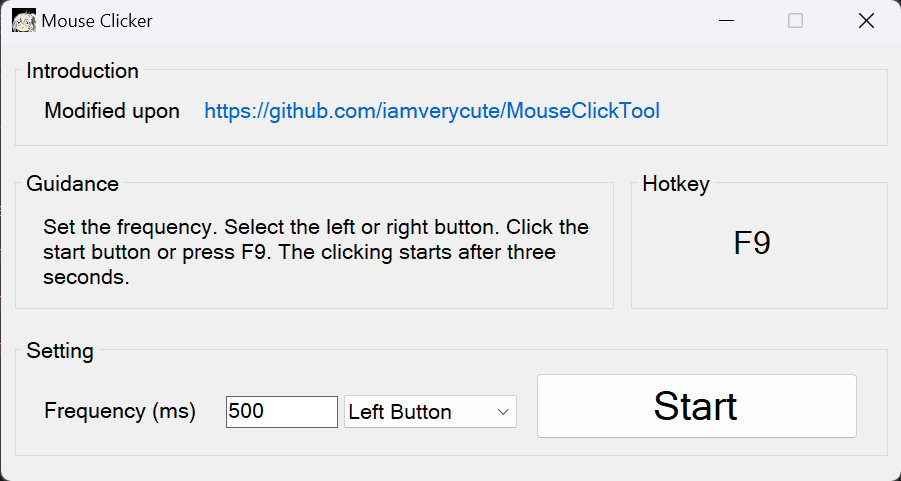

# New Mouse Click Tool

Modified upon [iamverycute/MouseClickTool: 简单好用的鼠标连点器（软件仅17KB） (github.com)](https://github.com/iamverycute/MouseClickTool).

Made several changes:

- The *Stop* button will no longer terminate the program.
- The waiting interval before starting is decreased to three seconds.
- UI is slightly optimized and translated to English.
- Hotkey support added.

Download the program on the [release](https://github.com/paimoooon/New-Mouse-Click-Tool/releases) page.

## Note

This program automatedly simulates the clicking of one of the mouse buttons at a fixed frequency. It is useful for tasks such as automatically playing through the plot cutscenes of a certain dead anime game.

## Screenshot

